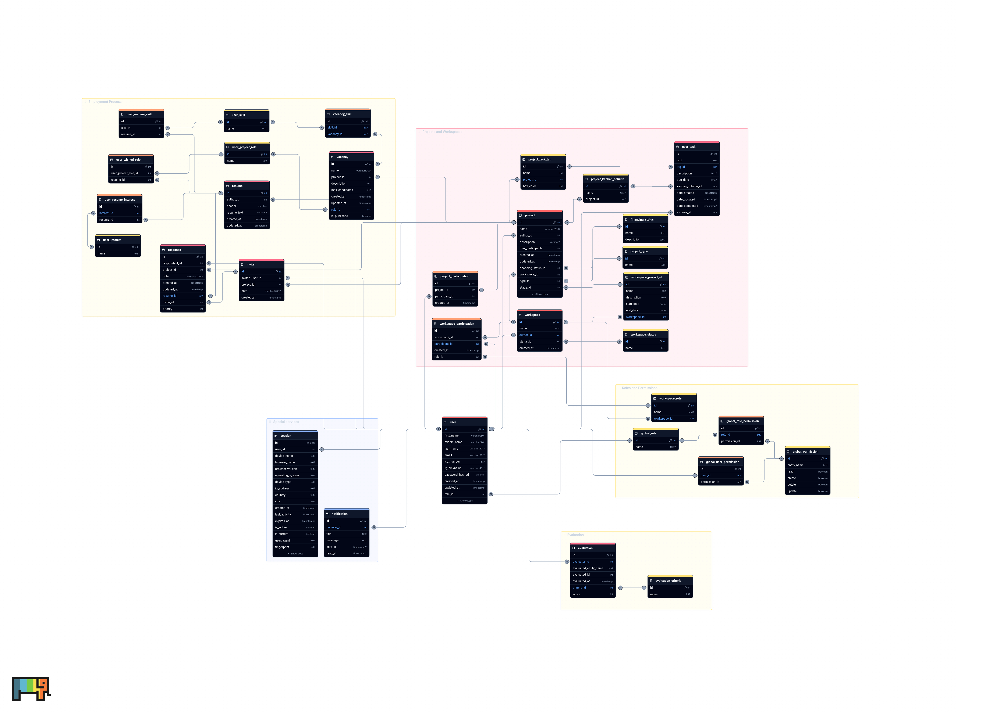

# Main database

Postgres is the main database.

# Caching

Redis for caching of the notifications and chats.

# Visualizing the schema

ChartDB is used to visualize the database scheme. Run it with:

`docker run -p 8080:80 ghcr.io/chartdb/chartdb:latest`

If you turn off this docker container gracefully, the progress should persist.

The schema of the database is available on google drive.
