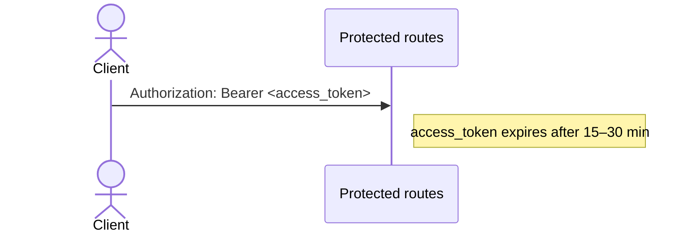
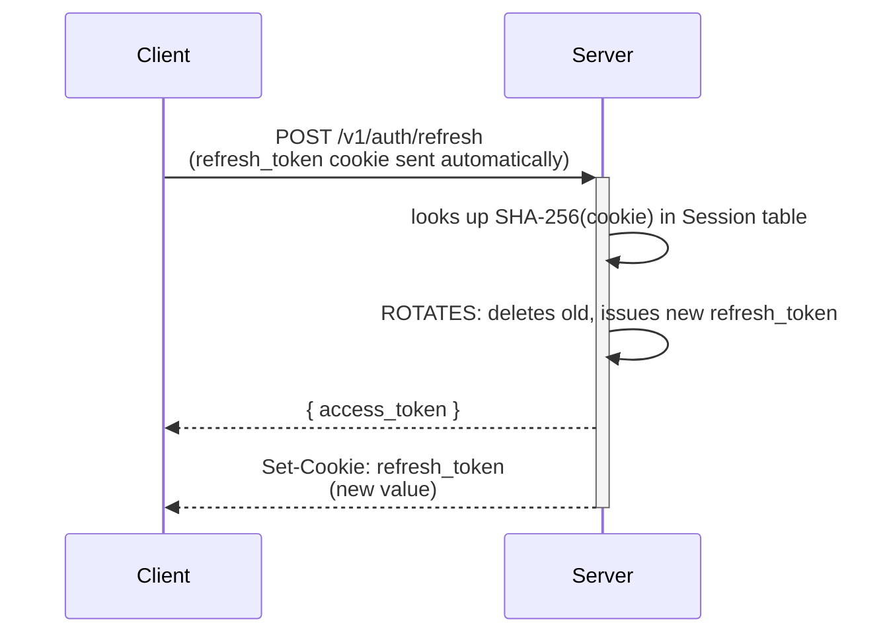
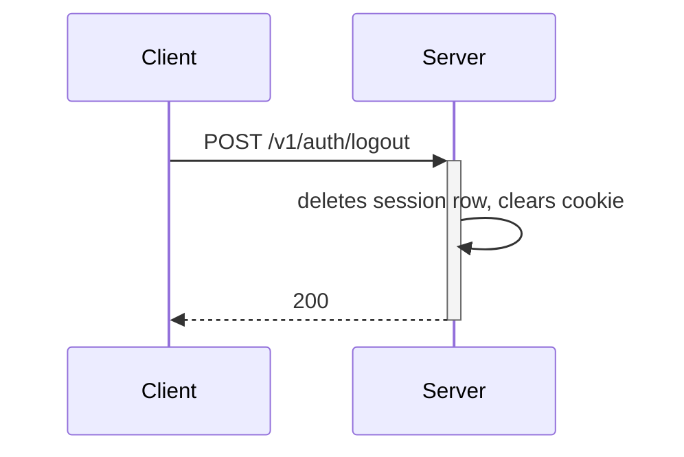

## Recommendation Document: Two-Token JWT Auth for Your FastAPI Project

---

### Current State Analysis

From reading your codebase, here's what's broken and why:

**The Swagger `tokenUrl` mismatch (root cause of broken docs)**

Your `oauth2_scheme` is declared as:
````python
# src/core/security.py
oauth2_scheme = OAuth2PasswordBearer(tokenUrl="v1/auth/token")
````
But your actual login endpoint is registered at `/v1/auth/login` (not `/v1/auth/token`). Swagger's "Authorize" button POSTs to the `tokenUrl` which doesn't exist → 404 → Swagger can't authenticate. Also, your `LoginForm` uses a custom `email` field, but `OAuth2PasswordBearer`'s Swagger form always sends `username` (the OAuth2 spec requirement). These two issues together break docs.

**The "Remember Me" field exists but is never used**

`LoginForm` collects `remember_me: bool`, but `login_for_access_token` in `auth_service.py` ignores it completely — the access token TTL is always `ACCESS_TOKEN_EXPIRE_MINUTES = 43200` (30 days!), which defeats the purpose and is a serious security issue.

**No refresh token system exists at all**

The `Session` model tracks device metadata, but there's no `refresh_token` field/table and no `/refresh` endpoint.

---

### Part 1 — Recommended Architecture

The industry-standard pattern for SPAs + mobile apps is:

**LoginFlow**

```mermaid
sequenceDiagram
    Note over Client,Server: The industry-standard pattern for SPAs + mobile apps is:
    Client->>+Server: POST /v1/auth/login<br/>  { email, password,<br/>    remember_me }
    Server-->>Server: validates credentials
    Server-->>Server: creates access_token (15–30 min)
    Server-->>Server: creates refresh_token (opaque random bytes)
    Server-->>Server: stores SHA-256(refresh_token) in DB (Session table)<br/>with TTL based on remember_me flag
    Server-->>Client: { access_token }
    Server-->>Client: Set-Cookie: refresh_token;<br/>HttpOnly; Secure; SameSite=Lax
    deactivate Server
```

**AccessFlow**



**RefreshFlow**



**LogoutFlow**



**Key design decisions:**

| Decision | Recommended Choice | Reason |
|---|---|---|
| Access token storage (client) | JS memory / `Authorization` header | Never persisted; XSS can't steal it from disk |
| Refresh token storage (client) | `HttpOnly; Secure; SameSite=Lax` cookie | JS-inaccessible, auto-sent by browser, CSRF-safe with `SameSite=Lax` |
| Refresh token storage (server) | `SHA-256(token)` in `Session` table | Raw token never stored; DB compromise doesn't leak valid tokens |
| Access token TTL (normal) | `15–30 minutes` | Short window if stolen |
| Access token TTL (remember me) | `15–30 minutes` still — only refresh token TTL changes | Access tokens stay short regardless |
| Refresh token TTL (no remember me) | `1 day` / session cookie | Expires on browser close or 24h |
| Refresh token TTL (remember me) | `30–90 days` | Persistent across browser restarts |
| Refresh token rotation | ✅ Yes, on every `/refresh` call | Single-use tokens; detects theft |
| Reuse detection | ✅ Yes — if an already-used token is presented, revoke the entire session family | Detects token theft early |

---

### Part 2 — Why NOT Other Storage Strategies

| Strategy | Risk | Verdict |
|---|---|---|
| `localStorage` for refresh token | Vulnerable to XSS — any injected script can read and exfiltrate it | ❌ Never |
| `sessionStorage` for refresh token | Same XSS risk as localStorage | ❌ Never |
| `localStorage` for access token | XSS risk — but short-lived, acceptable in low-risk apps | ⚠️ Acceptable only for access tokens |
| Cookie (non-HttpOnly) for either token | JS readable, XSS risk | ❌ Never |
| HttpOnly Cookie for access token | Swagger UI can't inject it into `Authorization` header | ⚠️ Breaks Swagger; use only for pure server-rendered apps |
| **HttpOnly Cookie for refresh token** | JS-inaccessible; CSRF prevented by SameSite | ✅ Recommended |
| Memory (JS variable) for access token | Lost on page refresh, must refresh immediately; best security posture | ✅ Ideal for SPAs |

---

### Part 3 — Fixing Swagger Documentation

This is your most immediate actionable fix. There are two sub-problems:

#### 3a. The `tokenUrl` is wrong

````python {src/core/security.py}
# WRONG — endpoint doesn't exist
oauth2_scheme = OAuth2PasswordBearer(tokenUrl="v1/auth/token")

# CORRECT — must match the actual login endpoint path
oauth2_scheme = OAuth2PasswordBearer(tokenUrl="v1/auth/login")
````

#### 3b. Swagger sends `username`, your endpoint expects `email`

`OAuth2PasswordBearer` in Swagger's "Authorize" dialog always uses the field name `username` (OpenAPI spec requirement). Your `LoginForm` renames it to `email`. You have two choices:

**Option A (Recommended — keep the custom field name, fix Swagger display only):**
Use a standard `OAuth2PasswordRequestForm` under the hood but alias the field. The form already does this in your `super().__init__(username=email, ...)` — Swagger will just show `username` in its dialog. You must tell your users to enter their email in the `username` field, OR customize the Swagger UI. This is the simplest fix.

**Option B — Create a dedicated `/v1/auth/token` endpoint that conforms to OAuth2:**
Add a thin endpoint that accepts `OAuth2PasswordRequestForm` directly (with `username` = email), so Swagger's standard form works without confusion:

````python {src/api/v1/endpoints/auth.py}
from fastapi.security import OAuth2PasswordRequestForm

@auth_router.post("/token", response_model=Token, include_in_schema=False)
async def token_for_swagger(
    form_data: OAuth2PasswordRequestForm = Depends(),
    auth_service: AuthService = Depends(get_auth_service),
) -> Token:
    """OAuth2-compliant endpoint for Swagger Authorize button only"""
    return await auth_service.login_for_access_token(form_data)
````
This keeps `/login` as the main app endpoint with `remember_me`, and gives Swagger a spec-compliant `/token` to call. Then fix `tokenUrl`:
````python {src/core/security.py}
oauth2_scheme = OAuth2PasswordBearer(tokenUrl="v1/auth/token")
````

#### 3c. Documenting the refresh token flow in OpenAPI

Since the refresh token lives in an `HttpOnly` cookie (invisible to Swagger), document it explicitly:

````python {src/api/v1/endpoints/auth.py}
@auth_router.post(
    "/refresh",
    response_model=Token,
    responses={
        200: {"description": "New access token issued; refresh token rotated via Set-Cookie"},
        401: {"description": "Refresh token missing, expired, or already used (rotation reuse detection)"},
    },
    summary="Refresh access token",
    description=(
        "Send the `refresh_token` HttpOnly cookie (set automatically by browser). "
        "Returns a new `access_token` in the body and rotates the refresh token cookie. "
        "The old refresh token is immediately invalidated (rotation)."
    ),
)
async def refresh_token(request: Request, ...): ...
````

---

### Part 4 — Token Refresh Strategies Compared

| Strategy | Description | Pros | Cons |
|---|---|---|---|
| **Passive (manual)** — *Recommended* | Frontend catches 401, calls `/refresh`, retries | Simple, deterministic, works with Swagger | Extra round-trip on expiry |
| **Proactive** | Frontend starts a timer, refreshes 1 min before expiry | Zero failed requests | Requires JS timer management; over-refreshes on tabs |
| **Sliding window** | Every authenticated request extends the access token TTL | Seamless UX | Stateful server; harder to scale; defeats short-TTL security |
| **Silent refresh in hidden iframe** | Old SPA OAuth trick | Works without cookies | Deprecated; `SameSite` cookie policies break it |

**Recommendation:** Passive refresh with rotation. Simple backend, simple frontend interceptor.

---

### Part 5 — Database Design for Refresh Tokens

Your existing `Session` model is almost perfect. You need to add a `refresh_token_hash` column:

````python {src/model/models.py}
class Session(Base):
    __tablename__ = "session"

    # ...existing columns...

    # Add these two columns for refresh token support:
    refresh_token_hash: Mapped[str | None] = mapped_column(String(64), nullable=True, unique=True, index=True)
    # SHA-256 hex digest of the raw refresh token; raw token is never stored
    
    token_family: Mapped[str | None] = mapped_column(String(36), nullable=True, index=True)
    # UUID identifying a rotation chain; reuse of any token in a family revokes all
````

**Backend storage flow:**
1. Generate raw token: `secrets.token_urlsafe(32)` (48 URL-safe chars ≈ 256 bits of entropy)
2. Hash for storage: `hashlib.sha256(raw_token.encode()).hexdigest()`
3. Return raw token to client (in cookie); store only the hash
4. On refresh: hash incoming cookie value, look up `Session` by hash, validate, rotate

---

### Part 6 — Implementation Approach (Step-by-Step Plan)

**Phase 1: Fix Swagger immediately (30 min)**
1. Add `/v1/auth/token` shim endpoint (Option B above)
2. Fix `tokenUrl` in `security.py` to `"v1/auth/token"`
3. Reduce `ACCESS_TOKEN_EXPIRE_MINUTES` from 43200 (30 days!) to 30

**Phase 2: Add refresh token infrastructure**
1. Add `refresh_token_hash` + `token_family` columns to `Session` model + Alembic migration
2. Add `REFRESH_TOKEN_EXPIRE_DAYS` (1 day) and `REFRESH_TOKEN_REMEMBER_ME_DAYS` (30 days) to `Settings`
3. Add `create_refresh_token()` method to `AuthService`
4. Modify `login_for_access_token` to: generate + store refresh token, set `HttpOnly` cookie on `Response`, respect `remember_me` flag for cookie TTL

**Phase 3: Add `/refresh` and update `/logout`**
1. Add `POST /v1/auth/refresh` endpoint: reads cookie → validates → rotates → returns new access token
2. Update `/logout` to: delete `Session` row (invalidate refresh token), clear cookie via `response.delete_cookie()`
3. Add reuse detection: if a `token_family` is reused after rotation, revoke all sessions in that family

**Phase 4: Harden access token TTL**
1. Access token: 15–30 min regardless of `remember_me`
2. `remember_me` only extends refresh token lifetime, not access token

---

### Part 7 — Libraries & Tools

| Library | Purpose | Notes |
|---|---|---|
| `python-jose` | JWT encoding/decoding | Already in your `.venv` |
| `hashlib` (stdlib) | SHA-256 hashing of refresh tokens | No new dependency needed |
| `secrets` (stdlib) | Cryptographically secure token generation | No new dependency needed |
| `pwdlib` | Password hashing | Already in use in your project |
| `fastapi.responses.JSONResponse` | Setting cookies on responses | Built into FastAPI |
| `python-multipart` | Form data parsing for OAuth2 | Already in FastAPI deps |

**No new libraries are required** — your current stack has everything.

---

### Part 8 — Security Considerations & Mitigations

| Threat | Mitigation |
|---|---|
| XSS stealing refresh token | `HttpOnly` cookie — JS cannot read it |
| CSRF using refresh token cookie | `SameSite=Lax` (or `Strict`) on cookie; refresh endpoint doesn't take body params attacker can forge |
| Refresh token theft from DB breach | Store only `SHA-256(token)` — raw token never persisted |
| Replay of already-rotated token | Token family tracking: reuse triggers full family revocation |
| Long-lived access token misuse | Keep TTL at 15–30 min; current 30-day TTL is a critical vulnerability |
| Brute-force on refresh token | 256 bits entropy (`secrets.token_urlsafe(32)`) — computationally infeasible |
| Cookie interception in transit | `Secure` flag on cookie — only sent over HTTPS |
| Multiple concurrent refresh calls | Make DB update atomic (use `SELECT FOR UPDATE` or optimistic locking on `refresh_token_hash`) |

---

### Relevant References

- [FastAPI Security – OAuth2 with JWT](https://fastapi.tiangolo.com/tutorial/security/oauth2-jwt/) — official baseline
- [FastAPI Security Reference – `OAuth2PasswordBearer` with `refreshUrl`](https://fastapi.tiangolo.com/reference/security/) — `refreshUrl` param exists but is cosmetic only in OpenAPI 3.0
- [OWASP – Refresh Token Best Practices](https://cheatsheetseries.owasp.org/cheatsheets/JSON_Web_Token_for_Java_Cheat_Sheet.html) — token storage, rotation, reuse detection
- [RFC 6750 – Bearer Token Usage](https://datatracker.ietf.org/doc/html/rfc6750) — `Authorization: Bearer` standard
- [Swagger Bearer Auth Docs](https://swagger.io/docs/specification/v3_0/authentication/bearer-authentication/) — documenting `bearerFormat: JWT` in OpenAPI

---

### TL;DR Priority Order

1. **Critical security bug now:** Change `ACCESS_TOKEN_EXPIRE_MINUTES` from `43200` (30 days) to `30`
2. **Fix Swagger:** Add `/token` shim, fix `tokenUrl`
3. **Implement refresh token:** Add `refresh_token_hash` to `Session`, new `/refresh` endpoint, `HttpOnly` cookie
4. **Wire `remember_me`:** Short vs. long refresh token TTL based on the flag (already collected, never used)

> **Suggested next step:** Ask me to implement Phase 1 (Swagger fix + token TTL) — it's a safe, isolated, non-breaking change you can ship immediately.

