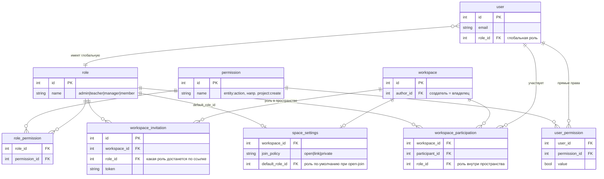
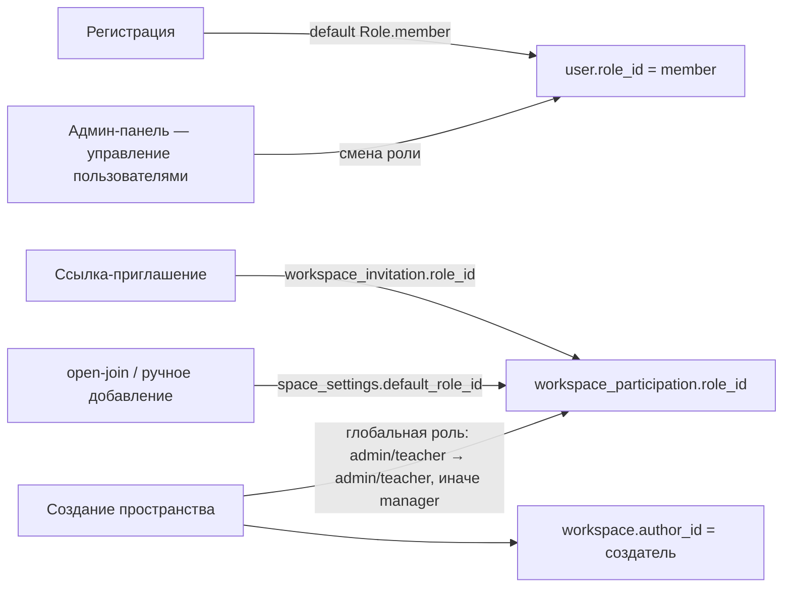

# Роли и права доступа

Схема системы ролей, прав и ограничений в EduFlow. Охватывает backend (FastAPI + SQLAlchemy) и frontend (React).

## 1. Общая картина: три независимых слоя прав

```
┌────────────────────────────────────────────────────────────────────────────┐
│  1. ГЛОБАЛЬНАЯ РОЛЬ  (user.role_id → role)                                 │
│     4 роли: admin / teacher / manager / member                             │
│     Проверяется через permission_required("entity:action")                 │
│     Набор прав = role_permission(глобальная роль) ∪ user_permission(прямые)│
├────────────────────────────────────────────────────────────────────────────┤
│  2. РОЛЬ В ПРОСТРАНСТВЕ  (workspace_participation.role_id → role)          │
│     Та же таблица role, но назначение своё (ссылка-приглашение, ручное)    │
│     Проверяется ТОЛЬКО отдельными местами (stage/type moderation, frontend)│
├────────────────────────────────────────────────────────────────────────────┤
│  3. ПРАВА СОЗДАТЕЛЯ  (author_id / respondent_id)                           │
│     «Кто создал — тот владелец». Не зависит от прав ни одной из ролей.     │
│     workspace.author_id, project.author_id, resume.author_id               │
└────────────────────────────────────────────────────────────────────────────┘
```

Ключевая особенность: **слой 1 не видит слоя 2**. `permission_required` смотрит только на глобальную роль. Роль в пространстве и статус создателя проверяются вручную в отдельных местах (см. §5.3 и §5.4). Отсюда, в частности, был баг с показом глобальной роли в списке участников.

## 2. Модель данных (ER-диаграмма)



Пояснения к полям:
- `user.role_id` — **глобальная** роль (одна на пользователя).
- `workspace_participation.role_id` — роль пользователя **в конкретном пространстве**.
- `workspace_invitation.role_id` — роль, которую получит пользователь, принявший ссылку.
- `space_settings.default_role_id` — роль для `open`-присоединения.
- `user_permission` — прямые права конкретного пользователя (механизм зарезервирован, в БД пуст, никем не заполняется).
- Автор/создатель фиксируется отдельными полями: `workspace.author_id`, `project.author_id`, `resume.author_id`, `project_response.respondent_id`.

## 3. Роли (сид в `fixtures_service.py`)

| Роль | ID | Назначение |
|---|---|---|
| `admin` | 1 | Глобальный администратор: все права; доступ к `/admin/*`, управление ролями/правами/сессиями |
| `teacher` | 2 | Преподаватель: полный CRUD контента, создание пространств и проектных типов |
| `manager` | 4 | Руководитель проекта: как member, но + `settings:read`, `session:create`, `user:update` |
| `member` | 3 | Участник: базовый CRUD контента в своём пространстве |

Роли **не образуют иерархию** — это независимые наборы прав (прав нет «по наследству» от другой роли).

## 4. Матрица прав ролей (фактическое состояние БД, 52 права)

Обозначения: ✅ — есть, — — нет. Права вида `entity:create/read/update/delete`.

| Право | admin | teacher | manager | member |
|---|---:|---:|---:|---:|
| `audit:create` / `read` / `update` / `delete` | ✅ | — / ✅ / — / — | — / ✅ / — / — | — / ✅ / — / — |
| `ideas:create/read/update/delete` | ✅ | ✅ | ✅ | ✅ |
| `invitation:create/read/update/delete` | ✅ | ✅/✅/✅/— | ✅/✅/✅/— | ✅/✅/✅/— |
| `kanban:create/read/update/delete` | ✅ | ✅ | ✅ | ✅ |
| `notification:create/read/update/delete` | ✅ | ✅ | ✅/✅/✅/— | ✅/✅/✅/— |
| `perm:create/read/update/delete` | ✅ | — | — | — |
| `project:create/read/update/delete` | ✅ | ✅ | ✅ | ✅ |
| `resume:create/read/update/delete` | ✅ | ✅ | ✅ | ✅ |
| `role:create/read/update/delete` | ✅ | —/✅/—/— | —/✅/—/— | —/✅/—/— |
| `session:create/read/update/delete` | ✅ | ✅/✅/✅/— | ✅/✅/✅/— | —/✅/✅/— |
| `settings:create/read/update/delete` | ✅ | —/✅/—/— | —/✅/—/— | — |
| `user:create/read/update/delete` | ✅ | —/✅/✅/— | —/✅/✅/— | —/✅/—/— |
| `workspace:create/read/update/delete` | ✅ | ✅ | —/✅/—/— | —/✅/—/— |

Что отсюда следует:
- **admin** — единственная роль с правами `perm:*` и полным набором.
- **member и manager** одинаково могут создавать/менять проекты, резюме, идеи, канбан — на уровне прав они почти не отличаются по контенту.
- **различия manager vs member**: у manager есть `settings:read`, `session:create`, `user:update`.
- **workspace:create/update/delete** только у admin/teacher — «обычный» участник не создаёт и не удаляет пространства.

## 5. Как проверяются права

### 5.1 Стандартная проверка `permission_required("entity:action")`

```mermaid
flowchart TD
    A[HTTP-запрос с Bearer JWT] --> B[get_current_user<br/>валидация токена, выборка user]
    B --> C[permission_required<br/>проверка существования права]
    C -- права нет в БД --> D[404 Permission not found]
    C -- существует --> E[get_all_user_permissions<br/>user_permission(user) + role_permission(глобальная роль)]
    E -- есть право --> F[200 / выполнение]
    E -- нет права --> G[403 Not enough permissions]
```

Реализация: `src/core/dependencies.py::permission_required`, `src/services/auth_service.py::get_all_user_permissions` (~строки 583–592).

Используется в эндпоинтах: `resume`, `kanban`, `stage`, `project`, `ideas`, `workspace`, `user`, `role`, `invitation`, `session`, `perm` (см. §7).

### 5.2 Админ-эндпоинты `admin_required`

Отдельная проверка `current_user.role.name == "admin"` (`src/core/dependencies.py`), **не** по матрице прав. Используется в `/admin/*`: overview, sessions, stats, terminate, audit.

### 5.3 Права создателя (владельца) — поверх прав ролей

Проверка «создатель == текущий пользователь» выполняется **в дополнение** к `permission_required`. Даже имея право `project:update`, чужой проект менять нельзя:

| Объект | Где проверка | Форма |
|---|---|---|
| Пространство: update / delete / удалить участника | `workspace.py` + `workspace_service` | `permission_required("workspace:update/delete")` → `PermissionError` если `author_id != user` → 403 |
| Пространство: настройки get/put | `settings.py` | `workspace.author_id != user` → 403 (без `permission_required`) |
| Ссылка-приглашение: create/read/delete | `invitation.py` | `permission_required("invitation:create/read")` + `workspace.author_id != user` → 403 |
| Проект: update / удалить участника | `project_service.py` (строки 454, 503) | `permission_required("project:update")` → `PermissionError` → 403 |
| Резюме: update / delete / modify | `resume_service.py` (строки 180, 191, 421) | `permission_required("resume:update/delete")` → `PermissionError` → 403 |
| Отклик на проект (withdraw) / приглашение (accept/reject) | `project_service.py` (строки 164, 180, 217) | `response.respondent_id != user_id` → 403 |
| Чужие audit-логи | `audit.py` | `user_id != current` и не админ → 403 |

Итог: на практике доступ определяется пересечением «право роли» **И** «владелец объекта».

### 5.4 Роль в пространстве — где реально влияет

`stage_service.py`:
- `TEACHER_ROLES = {"teacher", "admin"}`, `MANAGE_ROLES = {"teacher", "admin", "manager"}`.
- `_can_manage_workspace`: **глобальная** роль ∈ {teacher, admin} **ИЛИ** роль в пространстве ∈ {teacher, admin, manager}.

Это единственное место, где роль из `workspace_participation` реально что-то решает на backend (управление типами проектов и этапами, approval/reject).

Frontend (`src/app/routes/app/space.tsx`, `share-space-modal.tsx`):
- `isManager = workspace_role ∈ {manager, admin, teacher}` (роль из `/workspaces/{id}/participants`, не глобальная).
- `canCreateProject = isManager && !hasCreatedProject`.
- Настройка «кто что может добавлять» через роли в модалке шаринга.
- `role` в sidebar (`/workspaces/menu`) — это **глобальная** роль.

### 5.5 Гейтинг на frontend

| Экран | Проверка | Источник |
|---|---|---|
| `/app/admin/*` (AdminLayout) | `profile.role !== "admin"` → redirect | `useProfile`, роль глобальная |
| `AdminNav` | только для админа | глобальная роль |
| Канбан/проекты/идеи — секции слайдера | рендерятся у всех залогиненных | — |
| SPA-страницы | глобальная роль из `/profile` и `/workspaces/menu` | — |

## 6. Как роли назначаются



- Глобальная роль меняется только в админ-панели (`admin/users.tsx` → `user.role_id`).
- Роль в пространстве: по ссылке (`share-space-modal` создаёт `workspace_invitation` с выбранной ролью), при добавлении участника, либо по `default_role_id` для открытых политик.
- **Роль в пространстве ограничена глобальной** (маппинг из `invitation_service.py`): admin → {admin}, teacher → {teacher}, member/manager → {member, manager}. При вступлении по ссылке (`join_by_link`) недопустимая роль заменяется на роль по умолчанию; при создании пространства автор получает admin/teacher по своей глобальной роли, иначе manager.
- На старте `FixtureService` приводит существующие `workspace_participation.role_id` к этому маппингу (идемпотентно).

Примечание: несмотря на маппинг, автор пространства управляет им по `workspace.author_id` независимо от роли (см. §3), поэтому «руководитель/manager» в списке участников — это именно роль в пространстве.

## 7. Карта «эндпоинт → проверка»

| Группа | Право (`permission_required`) | Доп. проверка |
|---|---|---|
| `/resume/*` | `resume:create/update/delete` | автор резюме |
| `/kanban/*` (+ таски) | `kanban:create/update/delete` | — |
| `/projects/*` | `project:create/update/delete` | автор проекта |
| `/ideas/*` | `ideas:create/update/delete` | — |
| `/workspaces/*` | `workspace:create/read/update/delete` | автор (update/delete, remove participant) |
| `/workspaces/*/invite-link`, `/invitations` | `invitation:create/read/update` | автор workspace (create/read/delete) |
| `/roles`, `/role_permissions` | `role:create/read/delete`, `perm:read/update` | — |
| `/users` | `user:create/read/update/delete` | — |
| `/user_permissions` | `perm:read/update` | — |
| `/sessions/*` | только один: `session:delete` | сессии свои/админ |
| `/admin/*` | — (использует `admin_required`) | только глобальный admin |
| `/audit/{user_id}` | — | свои — всегда; чужие — только admin |
| `/settings/workspaces/...` | — | только автор workspace |
| `/project-types`, `/stages` | `project:create/update/delete` + `_can_manage_workspace` | роль в пространстве (manager) |
| `/profile`, `/notifications`, `/auth/*` | только `get_current_user` | —

## 8. Замечания и известные несоответствия

1. **Часть прав в матрице «декоративные»** — не встречаются ни в одном `permission_required`: `settings:*`, `audit:*`, `notification:*`, `invitation:delete`, а также `read`-варианты `project:read`, `resume:read`, `ideas:read`, `kanban:read`. Соответствующие эндпоинты открыты через `get_current_user` или проверяются вручную. Матрица (§4) шире реального enforcement.
2. **`permission_required` не учитывает роль в пространстве** — это два независимых слоя (§1). «Могу ли я это сделать в рабочем пространстве?» решается вне матрицы (авторство + `_can_manage_workspace`). Проект на унификацию: сводить обе роли в одно решение.
3. **Дублирование проверок**: некоторые эндпоинты проверяют и право роли, и авторство (workspace update, invite-link) — при отказе права срабатывает 404 «право не найдено» раньше 403.
4. **`user_permission` зарезервирован, но не заполняется** — прямых выдач прав конкретному пользователю в системе нет, а матрица admin-панели сбрасывала бы роль в workspace при open (исправлено в `share-space-modal`).
5. **`isManager` на frontend vs `MANAGE_ROLES` backend** — выровнено: и frontend (`{manager, admin, teacher}`), и backend (`create_project` = `PROJECT_CREATE_ROLES`, `stage_service.MANAGE_ROLES`) используют один и тот же набор ролей.

Полный enforcement можно перепроверить по `src/api/v1/endpoints/*.py` и БД (`role_permission`). Матрица в §4 сгенерирована из фактических данных БД.